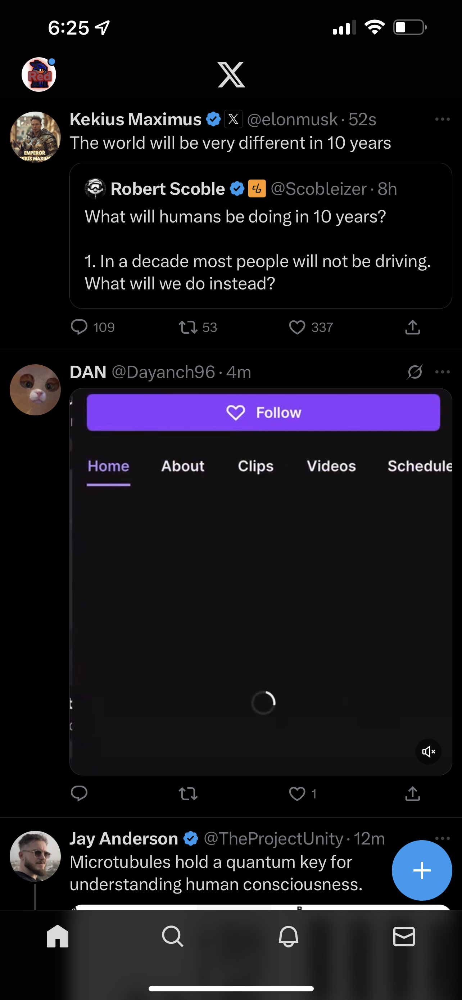

# XNotForMe
Not only has X/Twitter [nuked](https://tapbots.com/tweetbot/) all 3rd party apps, they now force a `For You` timeline filled with ads, unrelated topics, trash content and doomscrolling designed to waste your time. 

This is a quick and dirty tweak to regain your sanity and completely hide the `For You` tab in the X timeline.
The only timeline you need is the chronological one, with posts only from people you follow.

Works well for me with X v10.x.x, when also combined with [BHTwitter](https://github.com/BandarHL/BHTwitter) v4.4 to remove ads and other garbage.

## Getting Started
To use this tweak check out [releases](), grab `XNotForMe.dylib`, [BHTwitter.ipa](https://github.com/BandarHL/BHTwitter) inject `XNotForMe.dylib` via sideloadly or another signer of your choice.

### TrollStore 
Inject `XNotForMe.dylib` via [TrollFools](https://github.com/Lessica/TrollFools)

## Screenshot

## Credits
This was made possible by [n3d1117](https://github.com/n3d1117/XNotForMe) and [dayanch96](https://github.com/dayanch96/XNotForMe)